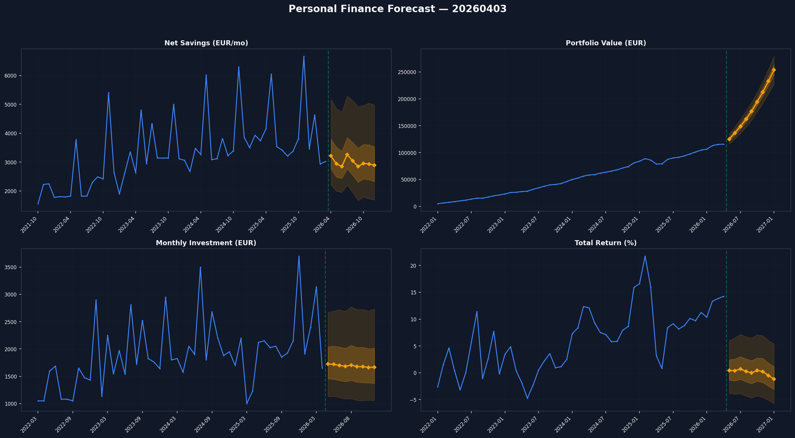
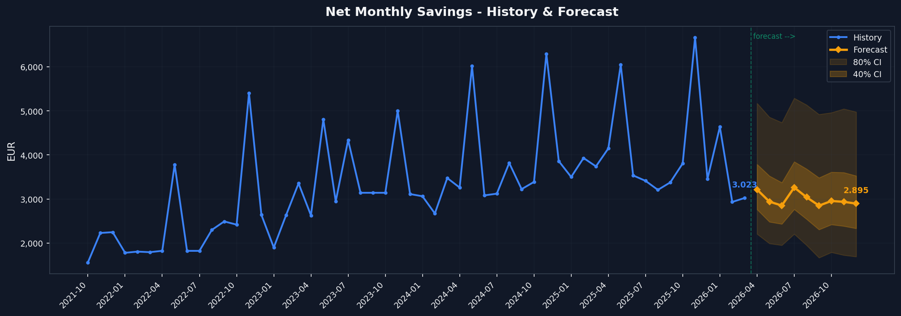
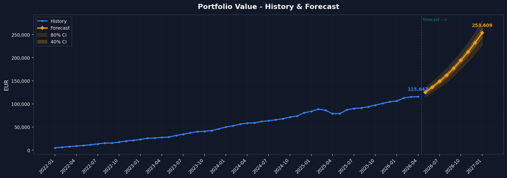
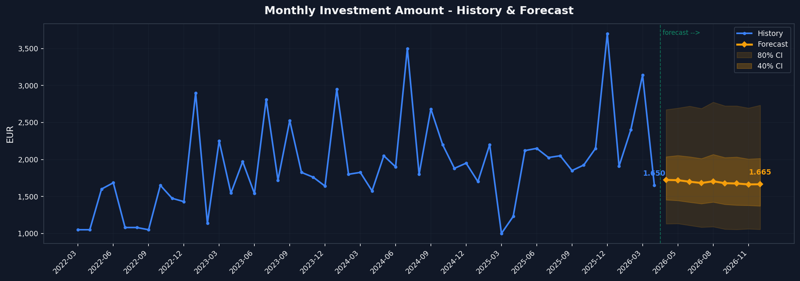
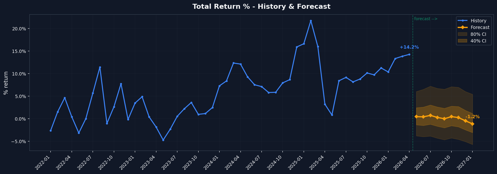

# Personal Finance Forecast — 20260403

**Generated:** 2026-04-03 15:17:30
**Model:** TimesFM 2.5 200M (PyTorch)  |  **Device:** NVIDIA GeForce RTX 5070
**Total runtime:** 7.1s

## Dashboard

## 1. Net Savings Forecast (Apr-Dec 2026)

| Month | Predicted | P10 (low) | P90 (high) |
|-------|-----------|-----------|------------|
| 2026-04 | 3.215 EUR | 2.205 EUR | 5.174 EUR |
| 2026-05 | 2.940 EUR | 1.990 EUR | 4.858 EUR |
| 2026-06 | 2.852 EUR | 1.950 EUR | 4.736 EUR |
| 2026-07 | 3.262 EUR | 2.204 EUR | 5.289 EUR |
| 2026-08 | 3.040 EUR | 1.949 EUR | 5.136 EUR |
| 2026-09 | 2.850 EUR | 1.667 EUR | 4.920 EUR |
| 2026-10 | 2.955 EUR | 1.790 EUR | 4.961 EUR |
| 2026-11 | 2.936 EUR | 1.726 EUR | 5.046 EUR |
| 2026-12 | 2.895 EUR | 1.691 EUR | 4.977 EUR |

**Total predicted:** 26.944 EUR over 9 months

**Key insight:** The model detects the November bonus pattern (avg 5.117 EUR vs 3.190 EUR other months). May also shows elevated savings.

## 2. Portfolio Value Forecast

| Month | Value | MoM | P10 | P90 |
|-------|-------|-----|-----|-----|
| 2026-05 | 125.131 EUR | +8.2% | 115.535 EUR | 134.655 EUR |
| 2026-06 | 136.408 EUR | +9.0% | 125.162 EUR | 147.786 EUR |
| 2026-07 | 148.500 EUR | +8.9% | 135.641 EUR | 161.840 EUR |
| 2026-08 | 162.074 EUR | +9.1% | 146.847 EUR | 176.737 EUR |
| 2026-09 | 176.868 EUR | +9.1% | 159.988 EUR | 193.545 EUR |
| 2026-10 | 194.346 EUR | +9.9% | 175.932 EUR | 212.086 EUR |
| 2026-11 | 212.313 EUR | +9.2% | 191.129 EUR | 231.894 EUR |
| 2026-12 | 232.521 EUR | +9.5% | 209.456 EUR | 254.875 EUR |
| 2027-01 | 253.609 EUR | +9.1% | 227.002 EUR | 278.985 EUR |

**Current:** 115.647 EUR  ->  **Dec 2026:** 253.609 EUR (+119.3%)

## 3. Monthly Investment Forecast

| Month | Predicted | P10 | P90 |
|-------|-----------|-----|-----|
| 2026-04 | 1.723 EUR | 1.130 EUR | 2.674 EUR |
| 2026-05 | 1.720 EUR | 1.133 EUR | 2.695 EUR |
| 2026-06 | 1.699 EUR | 1.109 EUR | 2.721 EUR |
| 2026-07 | 1.682 EUR | 1.084 EUR | 2.690 EUR |
| 2026-08 | 1.705 EUR | 1.091 EUR | 2.775 EUR |
| 2026-09 | 1.679 EUR | 1.058 EUR | 2.725 EUR |
| 2026-10 | 1.675 EUR | 1.054 EUR | 2.725 EUR |
| 2026-11 | 1.663 EUR | 1.062 EUR | 2.695 EUR |
| 2026-12 | 1.665 EUR | 1.055 EUR | 2.734 EUR |

**Total new investment Apr-Dec 2026:** 15.211 EUR

## 4. Return % Trajectory

| Month | Return % | P10 | P90 |
|-------|----------|-----|-----|
| 2026-05 | +0.4% | -3.8% | +6.0% |
| 2026-06 | +0.4% | -4.0% | +6.5% |
| 2026-07 | +0.7% | -3.9% | +7.2% |
| 2026-08 | +0.3% | -4.3% | +6.7% |
| 2026-09 | -0.0% | -4.7% | +6.5% |
| 2026-10 | +0.4% | -4.3% | +7.1% |
| 2026-11 | +0.2% | -4.6% | +6.9% |
| 2026-12 | -0.5% | -5.1% | +6.0% |
| 2027-01 | -1.2% | -5.7% | +5.4% |

## Summary

| Metric | Current | Dec 2026 Forecast |
|--------|---------|-------------------|
| Portfolio Value | 115.647 EUR | 253.609 EUR |
| Total Invested | 101.219 EUR | ~116.430 EUR |
| Monthly Savings (avg) | 4.020 EUR | 2.994 EUR |
| Total Return | +14.2% | -1.2% (forecast) |

## Methodology

- **Model:** Google TimesFM 2.5 (200M params, pretrained time-series foundation model)
- **Net Savings & Investment:** Raw values (no transform needed — moderate range, no extreme trend)
- **Portfolio Value:** Log-returns to handle exponential growth trend
- **Confidence bands:** P10-P90 (80% CI) from continuous quantile head
- **Context:** Full history (54-52 months depending on series)
- **Horizon:** 9 months (Apr-Dec 2026)

---
*Generated by TimesFM 2.5 | 7.1s total runtime | NVIDIA GeForce RTX 5070*