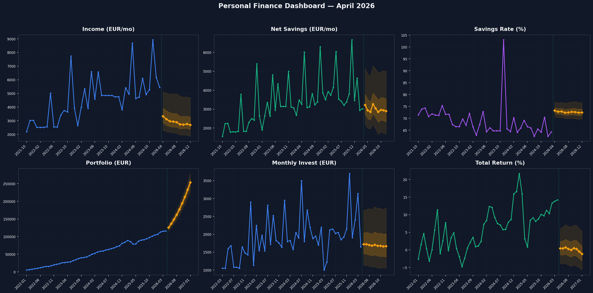
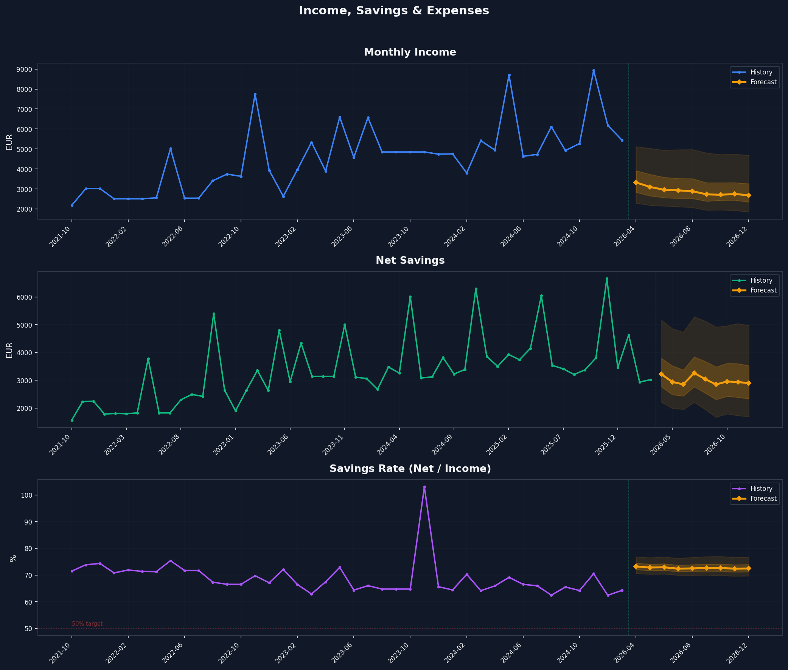
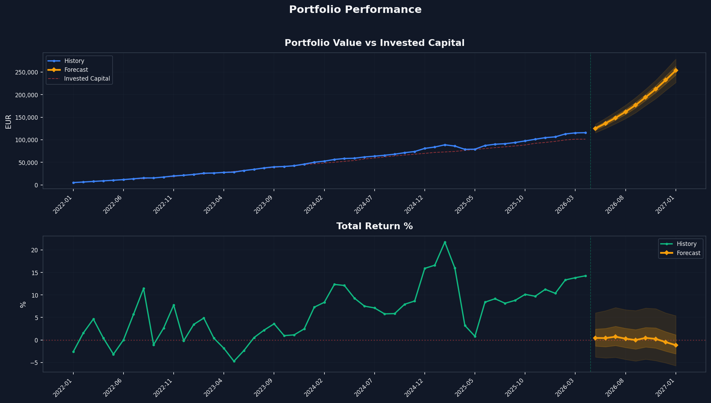
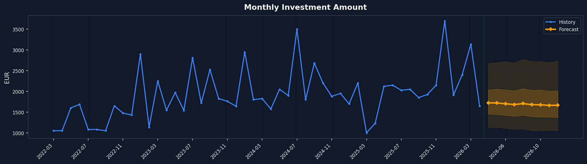

# Personal Finance Forecast Report

**Date:** 2026-04-03 15:24:33
**Model:** TimesFM 2.5 200M | **GPU:** NVIDIA GeForce RTX 5070 | **Runtime:** 7.9s
**Forecast horizon:** 9 months (Apr - Dec 2026)

---

## Dashboard

## Current Financial State (as of 2026-03)

| Metric | Value |
|--------|-------|
| Total saved (Oct 2021 - Mar 2026) | **180.738 EUR** |
| Portfolio value | **115.647 EUR** |
| Total invested (cost basis) | 101.219 EUR |
| Investment gains | 14.428 EUR (+14.2%) |
| Cash / other | ~79.519 EUR |
| Last monthly income | 5.450 EUR |
| Last monthly savings | 3.023 EUR |
| Average savings rate | 68.8% |
| Average monthly investment | 1.922 EUR |

## Seasonal Patterns

| Month | Avg Income | Avg Savings | Savings Rate | Avg Investment |
|-------|------------|-------------|--------------|----------------|
| Jan | 3.838 | 2.975 | 78% | 2.365 |
| Feb | 3.429 | 2.796 | 82% | 1.884 |
| Mar | 4.422 | 3.077 | 70% | 1.853 |
| Apr | 3.801 | 2.965 | 78% | 1.410 |
| May | 6.771 | 5.162 | 76% | 1.935 | **PEAK**
| Jun | 3.919 | 2.846 | 73% | 1.819 |
| Jul | 4.616 | 3.174 | 69% | 2.354 |
| Aug | 4.793 | 3.116 | 65% | 1.662 |
| Sep | 4.507 | 3.058 | 68% | 2.027 |
| Oct | 3.988 | 2.863 | 72% | 1.900 |
| Nov | 6.137 | 5.117 | 83% | 1.816 | **PEAK**
| Dec | 4.471 | 3.063 | 68% | 2.180 |

**Pattern:** May and November show 2x income spikes (bonuses/variable compensation), driving savings rate above 70%.

## 1. Income & Savings Forecast

| Month | Income | Net Savings | Savings Rate | Expenses |
|-------|--------|-------------|--------------|----------|
| 2026-04 | 3.329 | 3.215 | 97% | 114 |
| 2026-05 | 3.105 | 2.940 | 95% | 165 |
| 2026-06 | 2.961 | 2.852 | 96% | 109 |
| 2026-07 | 2.932 | 3.262 | 111% | -330 |
| 2026-08 | 2.892 | 3.040 | 105% | -148 |
| 2026-09 | 2.733 | 2.850 | 104% | -116 |
| 2026-10 | 2.712 | 2.955 | 109% | -243 |
| 2026-11 | 2.751 | 2.936 | 107% | -185 |
| 2026-12 | 2.689 | 2.895 | 108% | -207 |

| Totals (9 months) | 26.103 | 26.944 | 103% | -841 |

## 2. Portfolio Forecast

| Month | Value | P10 (bear) | P90 (bull) | MoM |
|-------|-------|------------|------------|-----|
| 2026-05 | 125.131 | 115.535 | 134.655 | +8.2% |
| 2026-06 | 136.408 | 125.162 | 147.786 | +9.0% |
| 2026-07 | 148.500 | 135.641 | 161.840 | +8.9% |
| 2026-08 | 162.074 | 146.847 | 176.737 | +9.1% |
| 2026-09 | 176.868 | 159.988 | 193.545 | +9.1% |
| 2026-10 | 194.346 | 175.932 | 212.086 | +9.9% |
| 2026-11 | 212.313 | 191.129 | 231.894 | +9.2% |
| 2026-12 | 232.521 | 209.456 | 254.875 | +9.5% |
| 2027-01 | 253.609 | 227.002 | 278.985 | +9.1% |

**115.647 EUR -> 253.609 EUR (+119.3%)**

*Note: Portfolio forecast extrapolates recent ~2.5%/mo growth trend. Use P10 (227.002 EUR) as conservative estimate.*

## 3. Monthly Investment Forecast

| Month | Predicted | P10 | P90 |
|-------|-----------|-----|-----|
| 2026-04 | 1.723 | 1.130 | 2.674 |
| 2026-05 | 1.720 | 1.133 | 2.695 |
| 2026-06 | 1.699 | 1.109 | 2.721 |
| 2026-07 | 1.682 | 1.084 | 2.690 |
| 2026-08 | 1.705 | 1.091 | 2.775 |
| 2026-09 | 1.679 | 1.058 | 2.725 |
| 2026-10 | 1.675 | 1.054 | 2.725 |
| 2026-11 | 1.663 | 1.062 | 2.695 |
| 2026-12 | 1.665 | 1.055 | 2.734 |

**Total new investment:** 15.211 EUR
**Projected total invested by Dec 2026:** ~116.430 EUR

## 4. Return Trajectory

| Month | Return % | P10 | P90 |
|-------|----------|-----|-----|
| 2026-05 | +0.4% | -3.8% | +6.0% |
| 2026-06 | +0.4% | -4.0% | +6.5% |
| 2026-07 | +0.7% | -3.9% | +7.2% |
| 2026-08 | +0.3% | -4.3% | +6.7% |
| 2026-09 | -0.0% | -4.7% | +6.5% |
| 2026-10 | +0.4% | -4.3% | +7.1% |
| 2026-11 | +0.2% | -4.6% | +6.9% |
| 2026-12 | -0.5% | -5.1% | +6.0% |
| 2027-01 | -1.2% | -5.7% | +5.4% |

## Summary: Where You'll Be by Dec 2026

| Metric | Now | Dec 2026 (forecast) | Change |
|--------|-----|---------------------|--------|
| Portfolio | 115.647 EUR | 253.609 EUR | +119.3% |
| Invested Capital | 101.219 EUR | ~116.430 EUR | +15.211 |
| Monthly Savings (avg) | 4.020 EUR | 2.994 EUR | |
| Savings Rate | 69% | 73% | |
| New Savings (9mo) | | 26.944 EUR | |
| New Investment (9mo) | | 15.211 EUR | |

## Methodology

- **Model:** Google TimesFM 2.5 (200M params, pretrained time-series foundation model)
- **Income, Savings, Investment:** Raw values (no transform — moderate range, seasonal)
- **Savings Rate:** Raw % values, compiled with negative-capable settings
- **Portfolio Value:** Log-returns to handle exponential growth, then reconstructed
- **Expenses:** Derived (Income - Net Savings), not independently forecast
- **Confidence:** P10-P90 (80% CI) from continuous quantile head
- **Context:** Full history (40-52 months depending on series)
- **Horizon:** 9 months
- **Caveats:** Portfolio forecast assumes trend continuation. Returns forecast shows mean reversion. Neither accounts for market shocks or life changes.

---
*Generated by TimesFM 2.5 | 7.9s | NVIDIA GeForce RTX 5070 | VRAM: 891MB / 11.9GB*